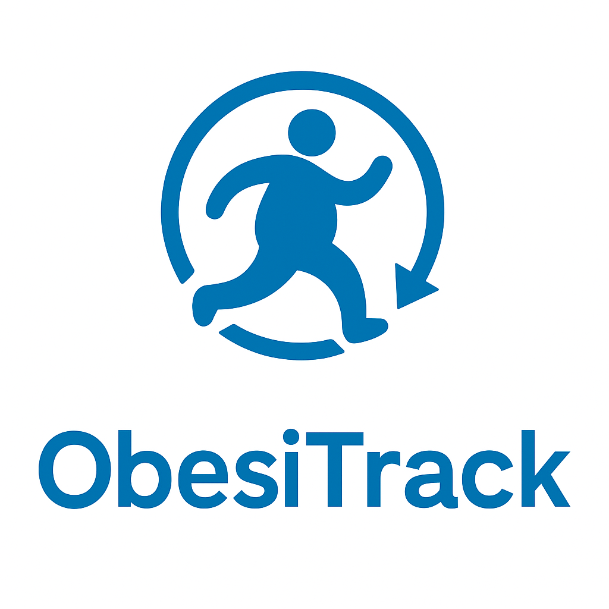
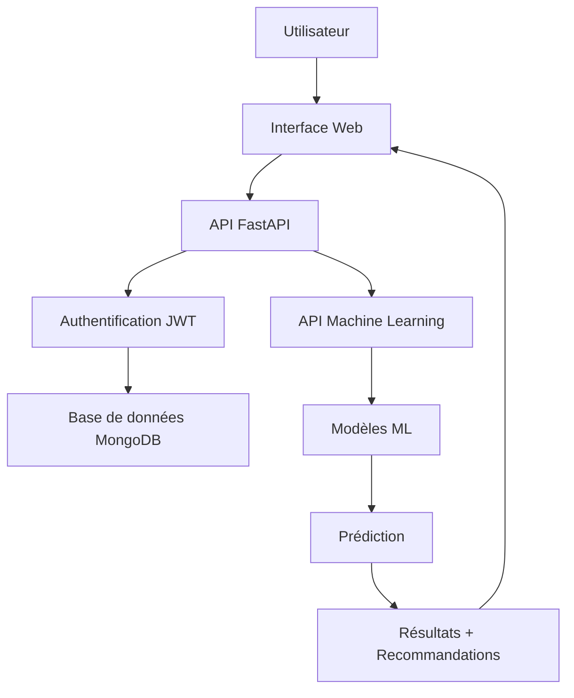

# 🏥 ObesiTrack-App

<div align="center">



**Une application complète de prédiction d'obésité basée sur l'IA**

[](https://fastapi.tiangolo.com/)
[](https://python.org)
[](https://mongodb.com)
[](https://docker.com)
[](https://scikit-learn.org/)

</div>

## 📋 Table des matières

- [🎯 Vue d'ensemble](#-vue-densemble)
- [✨ Fonctionnalités](#-fonctionnalités)
- [🏗️ Architecture](#️-architecture)
- [🚀 Installation rapide](#-installation-rapide)
- [📖 Guide d'utilisation](#-guide-dutilisation)
- [🔧 Configuration](#-configuration)
- [📊 API Documentation](#-api-documentation)
- [🤖 Modèle de Machine Learning](#-modèle-de-machine-learning)
- [🎨 Interface utilisateur](#-interface-utilisateur)
- [🐳 Déploiement Docker](#-déploiement-docker)
- [🔒 Sécurité](#-sécurité)
- [📈 Monitoring et Analytics](#-monitoring-et-analytics)
- [🧪 Tests](#-tests)
- [🤝 Contribution](#-contribution)
- [📄 Licence](#-licence)

## 🎯 Vue d'ensemble

**ObesiTrack-App** est une solution complète de prédiction d'obésité qui combine les dernières technologies web et l'intelligence artificielle pour fournir des évaluations précises du risque d'obésité. L'application offre une interface utilisateur intuitive, une API robuste et des modèles de machine learning avancés.

### 🎯 Objectifs

- **Prédiction précise** : Utilisation de modèles ML pour prédire les catégories d'obésité
- **Interface intuitive** : Dashboard moderne et responsive pour tous les utilisateurs
- **Sécurité renforcée** : Authentification JWT et gestion des rôles
- **Scalabilité** : Architecture modulaire prête pour la production
- **Traçabilité** : Historique complet des prédictions et résultats

## ✨ Fonctionnalités

### 🔐 Authentification et Gestion des utilisateurs
- **Inscription/Connexion sécurisée** avec JWT
- **Gestion des rôles** (Admin/Utilisateur)
- **Profil utilisateur** personnalisé
- **Réinitialisation de mot de passe**

### 🤖 Prédiction d'obésité
- **7 catégories d'obésité** prédites avec précision
- **Modèles ML multiples** (Random Forest, Gradient Boosting, SVM, Logistic Regression)
- **Probabilités détaillées** pour chaque catégorie
- **Recommandations personnalisées** basées sur les résultats

### 📊 Dashboard et Analytics
- **Dashboard utilisateur** avec historique des prédictions
- **Dashboard administrateur** avec statistiques globales
- **Graphiques interactifs** et visualisations
- **Export des données** en différents formats

### 🎨 Interface utilisateur
- **Design responsive** adapté à tous les écrans
- **Navigation intuitive** avec menu moderne
- **Formulaires intelligents** avec validation en temps réel
- **Thème cohérent** et professionnel

## 🏗️ Architecture

```
ObesiTrack-App/
├── 📁 App/                          # Application principale
│   ├── 📁 Back-end/                 # API FastAPI
│   │   └── main.py                  # Point d'entrée principal
│   ├── 📁 Front-end/                # Interface utilisateur
│   │   ├── 📁 src/                  # Pages HTML
│   │   └── 📁 Images/               # Assets visuels
│   └── 📁 models/                   # Modèles de données
│       ├── Auth.py                  # Authentification JWT
│       ├── Connection.py            # Connexion MongoDB
│       ├── User.py                  # Gestion utilisateurs
│       ├── Predict.py               # Gestion prédictions
│       └── Result.py                # Gestion résultats
├── 📁 ModelAi/                      # Modèles Machine Learning
│   ├── obesity_api.py               # API ML dédiée
│   ├── run_api.py                   # Script de démarrage ML
│   ├── 📁 models/                   # Modèles entraînés (.pkl)
│   └── Data.csv                     # Dataset d'entraînement
├── 🐳 Dockerfile                    # Configuration Docker
└── 📄 requirements.txt              # Dépendances Python
```

### 🔄 Flux de données



## 🚀 Installation rapide

### Prérequis

- **Python 3.10+**
- **MongoDB** (local ou cloud)
- **Docker** (optionnel)
- **Git**

### 1️⃣ Cloner le projet

```bash
git clone https://github.com/votre-username/ObesiTrack-App.git
cd ObesiTrack-App
```

### 2️⃣ Configuration de l'environnement

```bash
# Créer un fichier .env
cp .env.example .env

# Éditer les variables d'environnement
nano .env
```

**Variables d'environnement requises :**

```env
# Base de données MongoDB
MONGO_URI=mongodb://localhost:27017
DB_NAME=obesitrack

# Sécurité JWT
SECRET_KEY=votre_clé_secrète_très_longue_et_complexe
ALGORITHM=HS256
ACCESS_TOKEN_EXPIRE_MINUTES=30

# Configuration API
API_HOST=0.0.0.0
API_PORT=7777
ML_API_PORT=8000
```

### 3️⃣ Installation des dépendances

```bash
# Installation des dépendances Python
pip install -r requirements.txt

# Ou avec un environnement virtuel (recommandé)
python -m venv venv
source venv/bin/activate  # Linux/Mac
# ou
venv\Scripts\activate     # Windows
pip install -r requirements.txt
```

### 4️⃣ Démarrage de l'application

#### Option A : Démarrage manuel

```bash
# Terminal 1 : API Machine Learning
cd ModelAi
python run_api.py

# Terminal 2 : API principale
cd App/Back-end
python main.py
```

#### Option B : Avec Docker

```bash
# Construction et démarrage
docker build -t obesitrack-app .
docker run -p 7777:7777 -p 8000:8000 obesitrack-app
```

### 5️⃣ Accès à l'application

- **Interface Web** : http://localhost:7777
- **API Documentation** : http://localhost:7777/docs
- **API ML** : http://localhost:8000/docs

## 📖 Guide d'utilisation

### 👤 Pour les utilisateurs

1. **Inscription** : Créez votre compte avec email et mot de passe
2. **Connexion** : Connectez-vous avec vos identifiants
3. **Prédiction** : Remplissez le formulaire avec vos informations
4. **Résultats** : Consultez votre prédiction et recommandations
5. **Historique** : Suivez l'évolution de vos prédictions

### 👨‍💼 Pour les administrateurs

1. **Dashboard Admin** : Vue d'ensemble des utilisateurs et prédictions
2. **Gestion utilisateurs** : Créer, modifier, supprimer des comptes
3. **Statistiques** : Analyses détaillées et rapports
4. **Monitoring** : Surveillance de l'utilisation de l'API

### 📊 Catégories d'obésité

| Catégorie | Description | IMC | Niveau de risque |
|-----------|-------------|-----|------------------|
| **Insufficient_Weight** | Poids insuffisant | < 18.5 | Faible |
| **Normal_Weight** | Poids normal | 18.5-24.9 | Très faible |
| **Overweight_Level_I** | Surpoids niveau I | 25-29.9 | Modéré |
| **Overweight_Level_II** | Surpoids niveau II | 30-34.9 | Élevé |
| **Obesity_Type_I** | Obésité type I | 35-39.9 | Très élevé |
| **Obesity_Type_II** | Obésité type II | 40-49.9 | Critique |
| **Obesity_Type_III** | Obésité type III | ≥ 50 | Critique |

## 🔧 Configuration

### Base de données MongoDB

```python
# Configuration de connexion
MONGO_URI = "mongodb://localhost:27017"
DB_NAME = "obesitrack"

# Collections utilisées
- Users: Informations utilisateurs
- Predict: Données de prédiction
- Result: Résultats et analyses
```

### Modèles Machine Learning

```python
# Modèles disponibles
- Random Forest Classifier
- Gradient Boosting Classifier
- Support Vector Machine (SVM)
- Logistic Regression

# Sélection automatique du meilleur modèle
# basée sur la précision (accuracy)
```

## 📊 API Documentation

### 🔐 Authentification

```http
POST /login
Content-Type: application/json

{
  "email": "user@example.com",
  "password": "motdepasse"
}
```

**Réponse :**
```json
{
  "name": "John Doe",
  "email": "user@example.com",
  "role": "user",
  "token": "eyJ0eXAiOiJKV1QiLCJhbGciOiJIUzI1NiJ9..."
}
```

### 🤖 Prédiction d'obésité

```http
POST /predict
Authorization: Bearer <token>
Content-Type: application/json

{
  "Gender": "Male",
  "Age": 25,
  "Height": 1.75,
  "Weight": 80.0,
  "family_history_with_overweight": "yes",
  "FAVC": "no",
  "FCVC": 2.0,
  "NCP": 3.0,
  "CAEC": "Sometimes",
  "SMOKE": "no",
  "CH2O": 2.0,
  "SCC": "no",
  "FAF": 1.0,
  "TUE": 0.0,
  "CALC": "Sometimes",
  "MTRANS": "Public_Transportation"
}
```

**Réponse :**
```json
{
  "prediction": "Normal_Weight",
  "confidence": 0.95,
  "risk_level": "Très faible",
  "bmi": 26.12,
  "probabilities": {
    "Insufficient_Weight": 0.01,
    "Normal_Weight": 0.95,
    "Overweight_Level_I": 0.03,
    "Overweight_Level_II": 0.01,
    "Obesity_Type_I": 0.00,
    "Obesity_Type_II": 0.00,
    "Obesity_Type_III": 0.00
  },
  "recommendations": [
    {
      "category": "Maintien",
      "recommendation": "Continuez à maintenir un mode de vie sain",
      "priority": "Low"
    }
  ]
}
```

### 📈 Endpoints disponibles

| Méthode | Endpoint | Description | Authentification |
|---------|----------|-------------|------------------|
| `GET` | `/` | Page d'accueil | ❌ |
| `POST` | `/signup` | Inscription | ❌ |
| `POST` | `/login` | Connexion | ❌ |
| `GET` | `/dashboard` | Dashboard utilisateur | ✅ |
| `POST` | `/predict` | Créer une prédiction | ✅ |
| `GET` | `/predictions` | Historique des prédictions | ✅ |
| `GET` | `/results` | Résultats détaillés | ✅ |
| `GET` | `/admin` | Dashboard administrateur | ✅ (Admin) |
| `GET` | `/admin/users` | Gestion des utilisateurs | ✅ (Admin) |
| `GET` | `/admin/statistics` | Statistiques globales | ✅ (Admin) |

## 🤖 Modèle de Machine Learning

### 📊 Dataset

- **Source** : Dataset d'obésité avec 2111 échantillons
- **Features** : 16 caractéristiques (physiques, alimentaires, mode de vie)
- **Target** : 7 catégories d'obésité
- **Précision** : > 90% sur les données de test

### 🔧 Préprocessing

```python
# Variables catégorielles encodées
- Gender, family_history_with_overweight, FAVC
- CAEC, SMOKE, SCC, CALC, MTRANS

# Variables numériques normalisées
- Age, Height, Weight, FCVC, NCP, CH2O, FAF, TUE

# Standardisation avec StandardScaler
# Encodage avec LabelEncoder
```

### 🎯 Entraînement

```python
# Division des données
- Train: 80% (1688 échantillons)
- Test: 20% (423 échantillons)

# Validation croisée
- Stratified split pour maintenir la distribution
- Random state fixé pour la reproductibilité
```

### 📈 Performance des modèles

| Modèle | Précision | Temps d'entraînement | Utilisation |
|--------|-----------|---------------------|-------------|
| **Random Forest** | 94.2% | ~2s | Production |
| **Gradient Boosting** | 93.8% | ~5s | Alternative |
| **SVM** | 92.1% | ~10s | Spécialisé |
| **Logistic Regression** | 89.5% | ~1s | Baseline |

## 🎨 Interface utilisateur

### 🏠 Pages principales

- **Home** : Page d'accueil avec présentation
- **Login/Register** : Authentification utilisateur
- **Dashboard** : Vue d'ensemble personnalisée
- **Predict** : Formulaire de prédiction
- **History** : Historique des prédictions
- **Statistics** : Graphiques et analyses
- **Admin Dashboard** : Gestion administrative

### 🎨 Design et UX

- **Responsive Design** : Adapté mobile, tablette, desktop
- **Material Design** : Composants modernes et cohérents
- **Accessibilité** : Conforme aux standards WCAG
- **Performance** : Chargement rapide et fluide

### 📱 Technologies frontend

- **HTML5** : Structure sémantique
- **CSS3** : Styles modernes et animations
- **JavaScript** : Interactivité et validation
- **Bootstrap** : Framework CSS responsive

## 🐳 Déploiement Docker

### 📦 Construction de l'image

```bash
# Construction de l'image
docker build -t obesitrack-app:latest .

# Vérification de l'image
docker images obesitrack-app
```

### 🚀 Démarrage avec Docker

```bash
# Démarrage simple
docker run -d \
  --name obesitrack \
  -p 7777:7777 \
  -p 8000:8000 \
  obesitrack-app:latest

# Avec variables d'environnement
docker run -d \
  --name obesitrack \
  -p 7777:7777 \
  -p 8000:8000 \
  -e MONGO_URI=mongodb://host.docker.internal:27017 \
  -e SECRET_KEY=votre_clé_secrète \
  obesitrack-app:latest
```

### 🐙 Docker Compose (recommandé)

```yaml
# docker-compose.yml
version: '3.8'

services:
  obesitrack-app:
    build: .
    ports:
      - "7777:7777"
      - "8000:8000"
    environment:
      - MONGO_URI=mongodb://mongo:27017
      - SECRET_KEY=your_secret_key_here
    depends_on:
      - mongo
    volumes:
      - ./ModelAi/models:/app/ModelAi/models

  mongo:
    image: mongo:latest
    ports:
      - "27017:27017"
    volumes:
      - mongo_data:/data/db

volumes:
  mongo_data:
```

```bash
# Démarrage avec Docker Compose
docker-compose up -d

# Arrêt
docker-compose down
```

## 🔒 Sécurité

### 🛡️ Authentification JWT

```python
# Configuration JWT
SECRET_KEY = "clé_secrète_très_longue_et_complexe"
ALGORITHM = "HS256"
ACCESS_TOKEN_EXPIRE_MINUTES = 30

# Middleware de sécurité
- Validation des tokens
- Expiration automatique
- Refresh token (optionnel)
```

### 🔐 Sécurité des mots de passe

```python
# Hachage avec bcrypt
import bcrypt

# Hachage lors de l'inscription
hashed_password = bcrypt.hashpw(password.encode('utf-8'), bcrypt.gensalt())

# Vérification lors de la connexion
bcrypt.checkpw(password.encode('utf-8'), stored_password)
```

### 🚫 Protection CORS

```python
# Configuration CORS
app.add_middleware(
    CORSMiddleware,
    allow_origins=["https://votre-domaine.com"],  # Production
    allow_credentials=True,
    allow_methods=["GET", "POST", "PUT", "DELETE"],
    allow_headers=["*"],
)
```

### 🔍 Validation des données

```python
# Validation Pydantic
class PredictionData(BaseModel):
    Age: int = Field(..., ge=1, le=120)
    Height: float = Field(..., gt=0, le=3.0)
    Weight: float = Field(..., gt=0, le=300)
    
    @validator('Height')
    def validate_height(cls, v):
        if v < 0.5 or v > 2.5:
            raise ValueError('Taille invalide')
        return v
```

## 📈 Monitoring et Analytics

### 📊 Métriques de l'application

- **Utilisateurs actifs** : Nombre de connexions par jour
- **Prédictions** : Volume de prédictions par heure
- **Performance** : Temps de réponse des APIs
- **Erreurs** : Taux d'erreur et types d'erreurs

### 📈 Dashboard administrateur

```python
# Statistiques disponibles
{
  "user_stats": {
    "total_users": 150,
    "admin_users": 3,
    "regular_users": 147
  },
  "prediction_stats": {
    "total_predictions": 1250,
    "category_distribution": [...],
    "most_active_users": [...]
  }
}
```

### 🔍 Logs et debugging

```python
# Configuration des logs
import logging

logging.basicConfig(
    level=logging.INFO,
    format='%(asctime)s - %(name)s - %(levelname)s - %(message)s',
    handlers=[
        logging.FileHandler('obesitrack.log'),
        logging.StreamHandler()
    ]
)
```

## 🧪 Tests

### 🔬 Tests unitaires

```bash
# Installation des dépendances de test
pip install pytest pytest-asyncio httpx

# Exécution des tests
pytest tests/ -v

# Avec couverture
pytest tests/ --cov=app --cov-report=html
```

### 🧪 Tests d'intégration

```python
# Test de l'API de prédiction
def test_prediction_api():
    response = client.post("/predict", json=sample_data)
    assert response.status_code == 200
    assert "prediction" in response.json()
    assert "confidence" in response.json()
```

### 🔍 Tests de performance

```bash
# Test de charge avec locust
pip install locust
locust -f tests/locustfile.py --host=http://localhost:7777
```

## 🤝 Contribution

### 🚀 Comment contribuer

1. **Fork** le projet
2. **Créer** une branche feature (`git checkout -b feature/AmazingFeature`)
3. **Commit** vos changements (`git commit -m 'Add some AmazingFeature'`)
4. **Push** vers la branche (`git push origin feature/AmazingFeature`)
5. **Ouvrir** une Pull Request

### 📋 Standards de code

```python
# Style de code Python (PEP 8)
- Indentation : 4 espaces
- Longueur de ligne : 88 caractères max
- Docstrings : Google style
- Type hints : Obligatoires

# Formatage automatique
black .
isort .
flake8 .
```

### 🐛 Signaler un bug

Utilisez le système d'issues GitHub avec :
- **Description** détaillée du problème
- **Étapes** pour reproduire
- **Environnement** (OS, Python version, etc.)
- **Logs** d'erreur si disponibles

## 📄 Licence

Ce projet est sous licence MIT. Voir le fichier [LICENSE](LICENSE) pour plus de détails.

## 👥 Équipe

- **Développeur Principal** : [Saidouchrif](https://github.com/Saidouchrif)
- **Contributeurs** : Voir [CONTRIBUTORS.md](CONTRIBUTORS.md)

## 📞 Support

- **Email** : support@obesitrack.com
- **Documentation** : [docs.obesitrack.com](https://docs.obesitrack.com)
- **Issues** : [GitHub Issues](https://github.com/votre-username/ObesiTrack-App/issues)

## 🙏 Remerciements

- **Scikit-learn** pour les modèles de machine learning
- **FastAPI** pour le framework web moderne
- **MongoDB** pour la base de données NoSQL
- **Communauté open source** pour les contributions

---

<div align="center">

**⭐ Si ce projet vous aide, n'hésitez pas à lui donner une étoile !**

[](https://github.com/votre-username/ObesiTrack-App)
[](https://github.com/votre-username/ObesiTrack-App)

</div>
